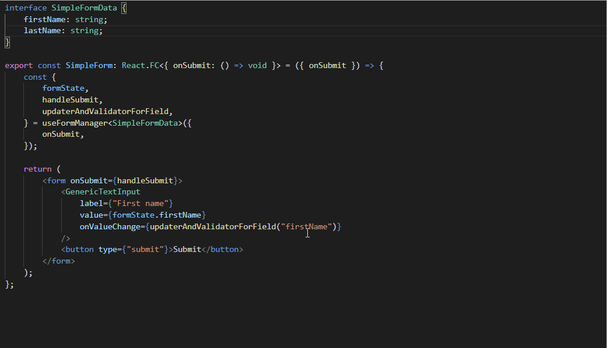

# react-simple-form-manager

## Table of contents

-   [Motivation](#motivation)
-   [Getting started](#getting-started)
-   [API](#api)
-   [Type safety and intellisense](#type-safety-and-intellisense)
-   [Usage examples](#usage-examples)
-   -   [Slightly less simple use case](#slightly-less-simple-use-case)
-   -   [Dealing with objects](#dealing-with-objects)

---

## Motivation

There are a lot of npm packages connected to [react forms](https://www.npmjs.com/search?q=react%20form) out there, and most of the popular ones support everything a form might require. Great, but that makes said tools complicated to use, even though a lot of forms might be small and simple.

What's missing? Something simple to manage the state and trigger the validations for a form. That is it.

**What this package aims to achieve:** One hook to easily and quickly manage the form data and validations with type support.

**What this package does not provide:** Inputs, wrappers, or any other form of UI components.

Although this package can be used with plain javascript, types are included in the package and you will only get the full benefit of intellisense with typescript.

---

## Getting started

Install the package

```
npm i react-simple-form-manager
```

Import the `useFormManager` and use it with your form component:

```tsx
import React from "react";
import { useFormManager } from "react-simple-form-manager";
import { GenericTextInput, GenericAmountInput } from "./inputs";

interface SimpleFormState {
    firstName: string;
    lastName: string;
    age: number;
}

export const SimpleForm: React.FC<SimpleFormProps> = (props) => {
    const formManager = useFormManager<SimpleFormState>({ onSubmit: props.onSubmit });

    return (
        <form onSubmit={formManager.handleSubmit}>
            <GenericTextInput
                label={"First Name"}
                onValueChange={formManager.updaterAndValidatorForField("firstName")}
                value={formManager.formState.firstName}
            />
            <GenericTextInput
                label={"Last Name"}
                onValueChange={formManager.updaterAndValidatorForField("lastName")}
                value={formManager.formState.lastName}
            />
            <GenericAmountInput
                label={"Age"}
                onValueChange={formManager.updaterAndValidatorForField("age")}
                value={formManager.formState.age}
            />
            <button type={"submit"}>Submit</button>
        </form>
    );
};
```

## API

### Props

| Name               | Type                                             | Default   | Description                                                     |
| ------------------ | ------------------------------------------------ | --------- | --------------------------------------------------------------- |
| initialState       | [Partial\<TFormState\>](#form-state)             | {}        | Initial data for form state                                     |
| validators         | [FormValidators\<TFormState\>](#form-validators) | {}        | Object with callbacks used to validate each form field          |
| showErrorsAfter    | [ShowErrorsAfter](#show-errors-after)            | "submit"  | Moment when to trigger the visibility of the validation errors  |
| onSubmit           | `(formState: TFormState) => void`                | undefined | Callback executed when the form is submitted with no errors     |
| allowInvalidSubmit | `boolean`                                        | undefined | Allow executing the `onSubmit` callback with errors or no edits |

### Output

| Name                         | Type                                                       | Description                                                 |
| ---------------------------- | ---------------------------------------------------------- | ----------------------------------------------------------- |
| formState                    | [TFormState](#form-state)                                  | The current form state                                      |
| hasEdits                     | `boolean`                                                  | If there was any change to the initialState                 |
| hasErrors                    | `boolean`                                                  | If there are any errors in the form state                   |
| visibleErrors                | [VisibleErrors](#visible-errors)                           | Object with the errors that should be visible               |
| updaterAndValidatorForField  | `(fieldName: string) => (fieldValue: TFormValue) => void;` | Returns the callback to update the field value              |
| allowErrorVisibilityForField | `(fieldName: string) => () => void;`                       | Returns the callback to trigger the visibility of the error |
| updateAndValidateField       | `(fieldName: string, fieldValue: TFormValue) => void;`     | Callback to update the field value                          |
| updateAndValidateState       | `(formState: TFormState) => void;`                         | Callback to update the whole state at once                  |
| allowErrorVisibility         | `(fieldName: string) => void;`                             | Callback to trigger the visibility of the error             |
| handleSubmit                 | `() => void;`                                              | Callback to pass to the form `onSubmit`                     |

### Form state

To have full intellisense and type support, you should provide a form interface to the `useFormManager<MyCustomFormInterface>()`.

_Note_: Each field may be of any type, but nesting is not supported. If a field is `myCustomField: SomeComplexObject` the callback to update `myCustomField` will override the whole object every time.

```typescript
interface MyCustomFormInterface {
    firstName: string;
    lastName: string;
    age: number;
    address: SomeComplexAddress;
}

interface SomeComplexAddress {
    street: string;
    city: string;
}
...

const formManager = useFormManager<MyCustomFormInterface>({
    initialState: {
        firstName: "John",
        lastName: "Doe",
        age: 18,
        address: {
            street: "My street name",
            city: "My city name",
        },
    },
});
```

### Form validators

```typescript
type FormFieldHasErrors = (fieldValue: TFieldValue, formState?: TFormState) => boolean;
```

All validation callbacks are optional. Fields with no validation callback are always valid.
The callback should **return true if there are any errors**.

You can validate each field independently:

```typescript
export const requiredString = (fieldValue: string) => {
    return !fieldValue;
};

export const percentageValidator = (percentage: number) => {
    return !percentage || percentage < 0 || percentage > 100;
};
```

Or you can take other form fields into consideration:

```typescript
export const hasErrorInPaidAmount = (paidAmount: number, formState: TFormState) => {
    return !paidAmount || paidAmount > formState.totalAmount;
};
```

Each validator has the name of the field it corresponds to:

```typescript
interface MyCustomForm {
    firstName: string;
    lastName: string;
    age: number;
}

...

const formManager = useFormManager<MyCustomForm>({
    validators: {
        firstName: someValidator,
        lastName: someValidator,
        age: someOtherValidator,
    },
})
```

### Show errors after

```typescript
type ShowErrorsAfter = "customTouch" | "submit" | "always";
```

Fields are validated on each change, but you might want to show the errors only after the user tried to submit, or `onBlur`, or maybe when some other event happens.

-   `always` will always display the error message for every field.
-   `submit` will display the error messages for every field after the user tries to submit the form for the first time.
-   `customTouch` will display the error message for each field as soon as the `allowErrorVisibility` is executed, and for every field after the the user tries to submit the form for the first time.

### Visible errors

An object that has the field name and a boolean that represents if the error should be visible or not, with the signature `Type VisibleErrors = Partial<Record<keyof TFormData, boolean>>`.

For example, these are the VisibleErrors generated by the `MyCustomForm` type:

```typescript
interface MyCustomForm {
    firstName: string;
    lastName: string;
    age: number;
}
interface VisibleErrors {
    firstName: boolean;
    lastName: boolean;
    age: boolean;
}
```

## Type safety and intellisense

If a type is provided to the `useFormManager<MyFormDataType>`, this package allows IDEs to work the intellisense magic and offers type safety for every attribute and attribute value type.



## Usage examples

### Slightly less simple use case

```tsx
interface SimpleFormState {
    firstName: string;
    lastName: string;
    age: number;
    loveForDogs: LoveForDogs;
    nationality: Nationality;
}

type LoveForDogs = "unconditional" | "dogs-are-fine" | "everyone-loves-dogs";

enum Nationality {
    Portuguese = "portuguese",
    Spanish = "spanish",
}

const initialFormState: Partial<SimpleFormState> = {
    firstName: "John",
    lastName: "Doe",
    nationality: Nationality.Portuguese,
    loveForDogs: "everyone-loves-dogs",
};

const nameErrorMessage = "Your must include a name and it must be less than 15 characters.";
const ageErrorMessage = "You must be at least 18 to continue.";

export const SlightlyLessSimpleForm: React.FC = () => {
    const handleSubmit = (formState: SimpleFormState) => {
        console.log("Saved form state: ", formState);
    };

    const formManager = useFormManager<SimpleFormState>({
        onSubmit: handleSubmit,
        initialState: initialFormState,
        validators: {
            firstName: (name: string) => requiredValidator(name) || maxLength(name),
            lastName: (name: string) => requiredValidator(name) || maxLength(name),
            age: (age: number) => age < 18,
        },
        showErrorsAfter: "customTouch",
    });

    return (
        <form onSubmit={formManager.handleSubmit}>
            <GenericTextInput
                label={"First Name"}
                value={formManager.formState.firstName}
                onValueChange={formManager.updaterAndValidatorForField("firstName")}
                onBlur={formManager.allowErrorVisibilityForField("firstName")}
                errorMessage={formManager.visibleErrors.firstName && nameErrorMessage}
            />
            <GenericTextInput
                label={"Last Name"}
                value={formManager.formState.lastName}
                onValueChange={formManager.updaterAndValidatorForField("lastName")}
                onBlur={formManager.allowErrorVisibilityForField("lastName")}
                errorMessage={formManager.visibleErrors.lastName && nameErrorMessage}
            />
            <GenericAmountInput
                label={"Age"}
                value={formManager.formState.age}
                onValueChange={formManager.updaterAndValidatorForField("age")}
                onBlur={formManager.allowErrorVisibilityForField("age")}
                errorMessage={formManager.visibleErrors.age && ageErrorMessage}
            />
            <LoveForDogsSelect
                label={"Love for dogs"}
                onValueChange={formManager.updaterAndValidatorForField("loveForDogs")}
                value={formManager.formState.loveForDogs}
            />
            <NationalitySelect
                label={"Choose your nationality"}
                onValueChange={formManager.updaterAndValidatorForField("nationality")}
                value={formManager.formState.nationality}
            />
            <button type={"submit"}>Submit</button>
        </form>
    );
};
```

### Dealing with objects

If your form has to deal with an object, say an address, there are three easy solutions:

1. [Use a helper method and spread the object;](#helper-method)
2. [Use a mapper to flatten and rebuild the data structure;](#mappers)
3. [Using a custom component that updates the whole object at once.](#custom-component)

#### Helper method

```tsx
interface SimpleFormState {
    someAttribute: string;
    address: {
        city: string;
        country: string;
    };
}

export const SimpleForm = () => {
    const formManager = useFormManager<SimpleFormState>({
        onSubmit: handleSubmit,
    });

    const handleUpdateCityAddress = (city: string) => {
        formManager.updateAndValidateField("address", {
            ...formManager.formState.address,
            city,
        });
    };

    const handleUpdateCountryAddress = (country: string) => {
        formManager.updateAndValidateField("address", {
            ...formManager.formState.address,
            country,
        });
    };

    return (
        <form onSubmit={formManager.handleSubmit}>
            <GenericTextInput
                label={"Country"}
                value={formManager.formState.address.country}
                onValueChange={handleUpdateCountryAddress}
            />
            <GenericTextInput
                label={"City"}
                value={formManager.formState.address.city}
                onValueChange={handleUpdateCityAddress}
            />
            <button type={"submit"}>Submit</button>
        </form>
    );
};
```

#### Mappers

```tsx
interface DataModel {
    someAttribute: string;
    address: {
        city: string;
        country: string;
    };
}
interface SimpleFormState {
    someAttribute: string;
    addressCity: string;
    addressCountry: string;
}

const mapDataModelToFormState = (data: DataModel): SimpleFormState => {
    return {
        someAttribute: data.someAttribute,
        addressCity: data.address.city,
        addressCountry: data.address.country,
    };
};

const mapFormStateToDataModel = (formState: SimpleFormState): DataModel => {
    return {
        someAttribute: formState.someAttribute,
        address: {
            city: formState.addressCity,
            country: formState.addressCountry,
        },
    };
};

export const SimpleForm = () => {
    const formManager = useFormManager<SimpleFormState>({
        initialState: mapDataModelToFormState(initialState),
        onSubmit: (formState: SimpleFormState) => handleSubmit(mapFormStateToDataModel(formState)),
    });

    return (
        <form onSubmit={formManager.handleSubmit}>
            <GenericTextInput
                label={"Country"}
                value={formManager.formState.addressCountry}
                onValueChange={formManager.updaterAndValidatorForField("addressCountry")}
            />
            <GenericTextInput
                label={"City"}
                value={formManager.formState.addressCity}
                onValueChange={formManager.updaterAndValidatorForField("addressCity")}
            />
            <button type={"submit"}>Submit</button>
        </form>
    );
};
```

#### Custom component

```tsx
interface SimpleFormState {
    someAttribute: string;
    address: {
        city: string;
        country: string;
    };
}

export const SimpleForm = () => {
    const formManager = useFormManager<SimpleFormState>({
        onSubmit: handleSubmit,
    });

    return (
        <form onSubmit={formManager.handleSubmit}>
            <GenericAddressComponent
                label={"Country"}
                value={formManager.formState.address}
                onValueChange={formManager.updaterAndValidatorForField("address")}
            />
            <button type={"submit"}>Submit</button>
        </form>
    );
};
```
